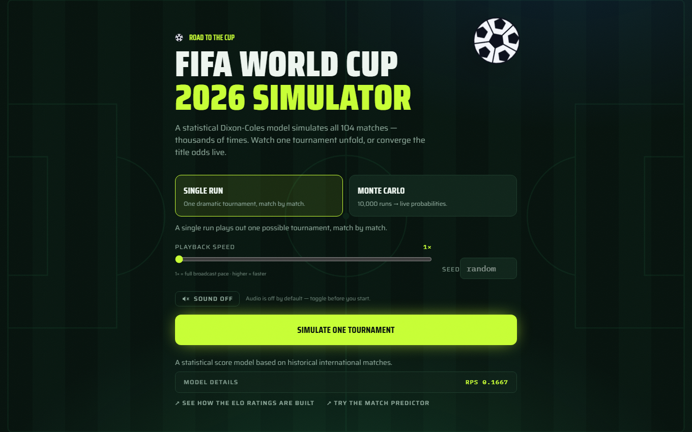
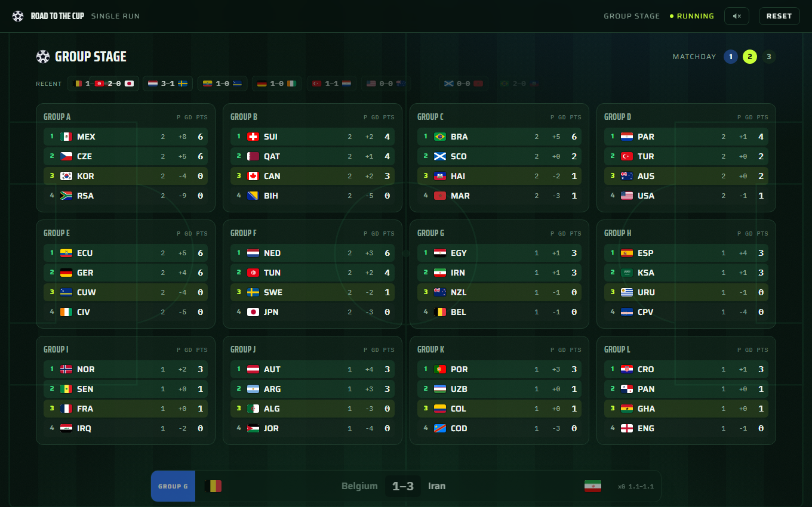
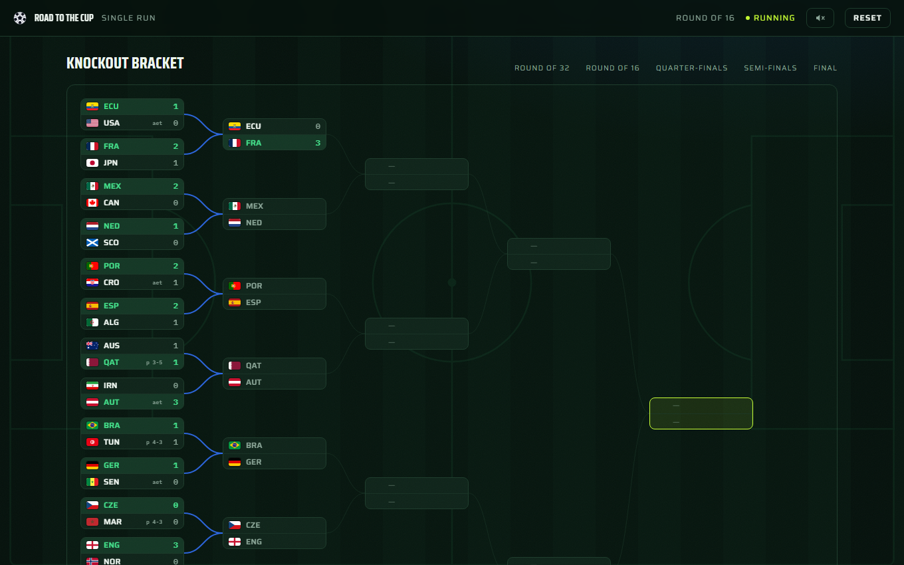
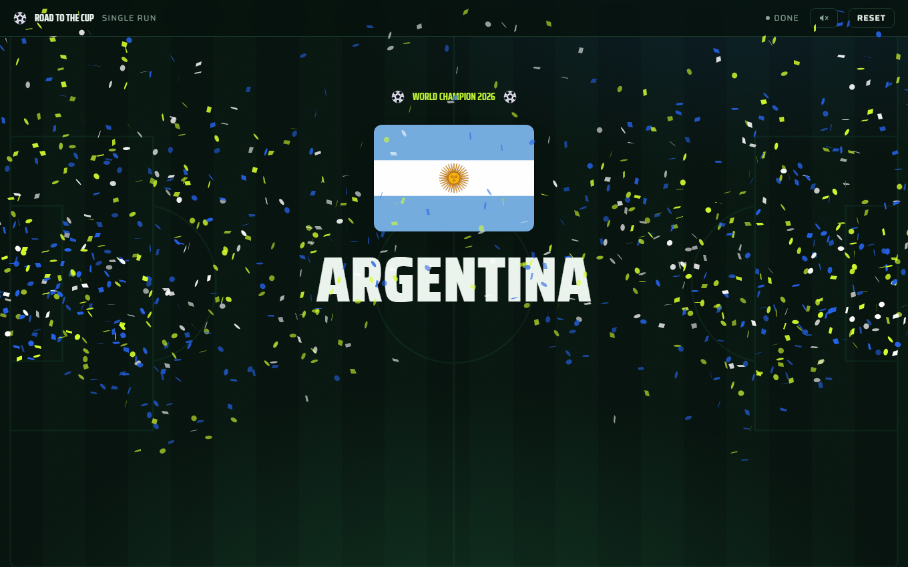
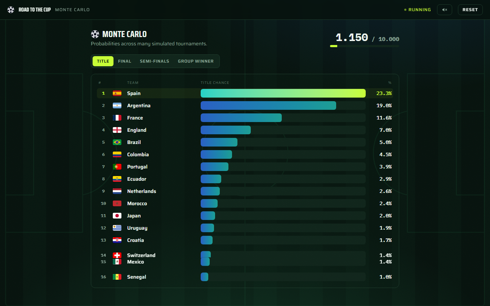
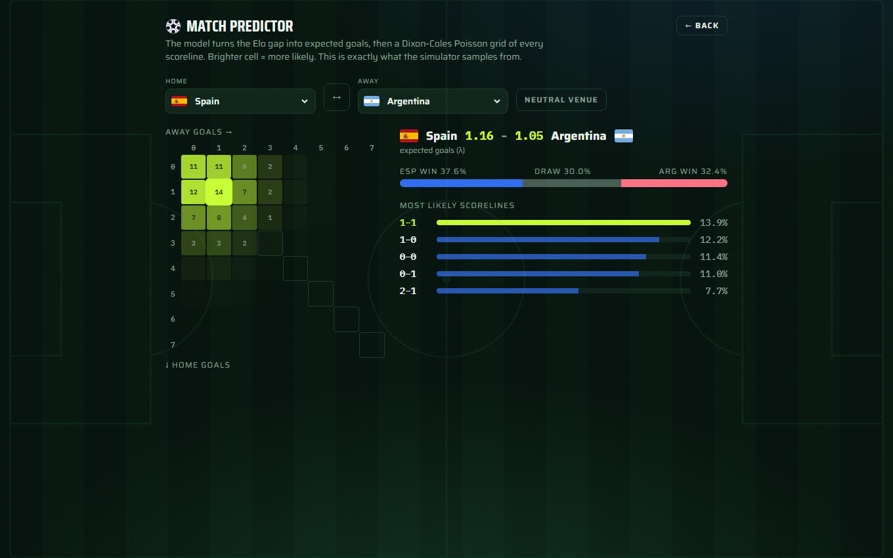
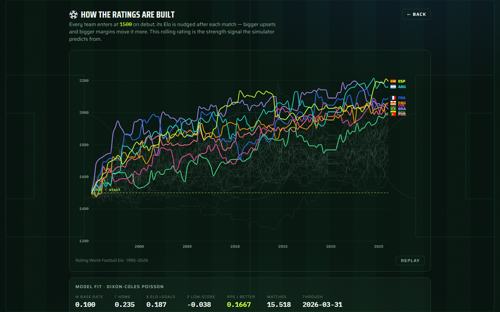

# Road to the Cup — FIFA World Cup 2026 Simulator

A statistical simulator for the **2026 FIFA World Cup** (48 teams, 12 groups,
104 matches) with a broadcast-style web UI. The backend predicts every match
with an Elo-driven **Dixon-Coles Poisson** model and plays the whole tournament
thousands of times; the frontend stages it like a TV graphics package.

> **Honest framing.** International football is data-sparse and high-variance.
> This is a transparent, well-calibrated *toy* — not an oracle.

---

## What it does

- **Predicts every match as a scoreline**, not just win/draw/lose — because group
  tables are decided on goal difference.
- **Single run** — play one tournament match-by-match, with live-sorting group
  tables and a knockout bracket that fills in as results come in.
- **Monte Carlo** — run the tournament up to 10,000 times and watch each team's
  Title / Final / Semi-final / Group-winner probabilities converge live.
- **Match predictor** — pick any two teams and see the full score-probability
  grid (the exact distribution the simulator samples from).
- **Ratings explorer** — watch every team's Elo evolve from 1500 over time.

## Screenshots

| | |
|---|---|
| <br>**Start screen** | <br>**Group stage — live-sorting tables** |
| <br>**Knockout bracket** | <br>**Champion reveal** |
| <br>**Monte-Carlo title odds** | <br>**Match predictor (score grid)** |
| <br>**Ratings explorer (Elo over time)** | |

## Architecture

```
FastAPI backend  ──WebSocket / REST──>  React + TypeScript frontend
  • rolling Elo ratings                   • broadcast scenes (Motion / GSAP)
  • Dixon-Coles Poisson model             • D3 bracket + racing bars
  • simulation engine (groups → KO)       • match predictor + ratings view
  • streams "broadcast" events
```

The model is trained **offline** and saved as small artifacts; the backend only
*loads* them — it never trains at runtime.

## Quickstart

**Prerequisites:** [uv](https://docs.astral.sh/uv/) (Python) and Node.js 20+.

### Backend

```bash
uv sync                              # create venv + install deps
uv run wm2026 serve                  # REST + WebSocket on http://localhost:8000
```

Pre-trained artifacts are committed, so `serve` works immediately. To regenerate
the model from scratch:

```bash
uv run wm2026 download-data          # fetch historical results (free GitHub mirror)
uv run wm2026 train                  # compute Elo + fit the model -> artifacts/
```

### Frontend

```bash
cd frontend
npm install
npm run dev                          # http://localhost:5173 (expects backend on :8000)
```

### CLI (headless)

```bash
uv run wm2026 simulate --mode single --seed 42        # one dramatic tournament
uv run wm2026 simulate --mode montecarlo -n 10000     # title probabilities
uv run wm2026 train --since 1995-01-01 --half-life 4  # tune the training window
```

### Dev

```bash
uv run ruff check . && uv run ruff format .
uv run pytest
cd frontend && npm run build
```

## How the model works

**1 · Elo (strength).** Every team starts at **1500** (from 1995 on). After each
match the winner takes points from the loser, scaled by the goal margin and the
match importance (a World Cup game counts far more than a friendly); home teams
get a bonus on non-neutral ground.

**2 · Expected goals.** The Elo gap becomes each side's expected goals:

```
λ_home = exp(μ + γ·home + β·(elo_home − elo_away)/100)
λ_away = exp(μ        − β·(elo_home − elo_away)/100)
```

`μ, γ, β` and the Dixon-Coles `ρ` are fit once by time- and importance-weighted
maximum likelihood over historical internationals.

**3 · Scoreline grid.** Each team's goals follow a Poisson distribution; the joint
table of every scoreline is their product, with a **Dixon-Coles** correction for
low-scoring draws. Summing cells gives win/draw/win probabilities.

**4 · Simulation.** For each of the 104 matches a scoreline is *sampled* from that
grid. Group standings use the official **FIFA tiebreakers**; the 8 best
third-placed teams are slotted in via FIFA's official 495-row matrix; knockout
ties go to extra time and penalties. Run it 10,000 times → probabilities.

**Calibration.** On a held-out backtest the model scores a Ranked Probability
Score of ~0.17 and predicts ~2.75 goals/game vs. ~2.78 actual — well calibrated.

## Project layout

```
src/wm2026/
  config/        verified tournament data (groups, teams, bracket, 3rd-place matrix)
  data.py        dataset download + loading
  elo.py         rolling World-Football Elo
  model.py       Dixon-Coles Poisson match model
  features.py    feature assembly / weighting
  train.py       offline training -> artifacts/
  tournament/    headless simulation engine (groups, knockout, Monte Carlo)
  api.py         FastAPI backend (REST + WebSocket)
  cli.py         download / train / simulate / serve
artifacts/       trained model + Elo ratings/history (committed)
frontend/        React + TypeScript broadcast UI
tests/           pytest suite
```

## Data & provenance

Primary source: the *International football results from 1872 to present* dataset
(Kaggle / the free `martj42/international_results` GitHub mirror). The 12-group
draw (5 Dec 2025), the Round-of-32 bracket, the third-place combination matrix
(FIFA regulations, Annex C) and the tiebreaker order were cross-verified against
multiple public sources. See the headers of `src/wm2026/config/*.json` for
per-file provenance.

## License

MIT
